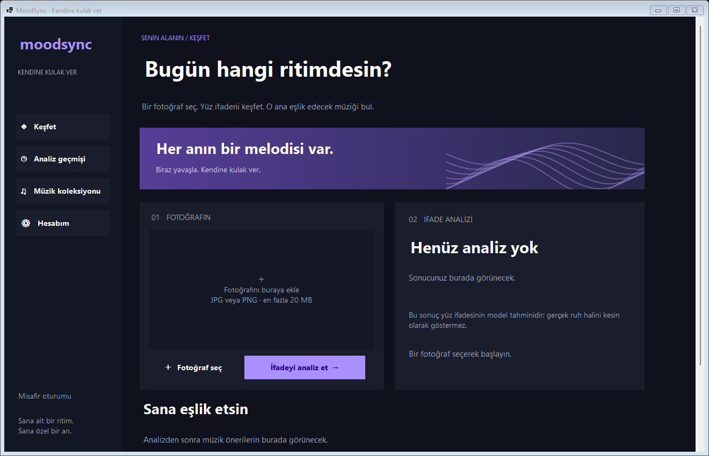

# MoodSync

Bitirme projem için geliştirdiğim, fotoğraftaki yüz ifadesine göre müzik öneren masaüstü uygulaması. C# Windows Forms, Python/YOLO ve SQL Server kullanıyor.

Bu sürümde eski uygulamanın arayüzünü yeniledim, kod yapısını düzenledim ve analiz sırasında karşılaşılan hataları düzelttim. Güncel kodlar `src/MoodSync` klasöründe; eski sürümün dosyaları depo kökünde duruyor.



## Neler değişti?

- Türkçe arayüz, fotoğraf önizlemesi ve müzik koleksiyonu eklendi.
- C# ile Python arasındaki dosya tabanlı iletişim JSON'a taşındı.
- Analiz sırasında arayüzün donması ve hatalı sonuçların işlenmesi düzeltildi.
- Yüz bulunamadığında, güven skoru düşük olduğunda veya birden fazla yüz tespit edildiğinde hata mesajı gösteriliyor.
- Parola saklama ve veritabanı bağlantıları düzenlendi.
- SQL bağlantısı olmadan kullanılabilen misafir modu eklendi.

## Kurulum

Windows, .NET 8 SDK ve Python 3.12 gerekiyor.

```powershell
git clone https://github.com/justlacia/Mood-Emotion-Detection-Project-with-CSharp-and-Python.git
cd Mood-Emotion-Detection-Project-with-CSharp-and-Python/src/MoodSync
python -m venv python/.venv
./python/.venv/Scripts/python.exe -m pip install -r python/requirements-lock.txt
```

`appsettings.json` içindeki `PythonExecutable` alanına, oluşturduğun sanal ortamdaki `python.exe` dosyasının tam yolunu yaz. Ardından:

```powershell
dotnet run --project MoodSync.csproj
```

Visual Studio kullanıyorsan `src/MoodSync/MoodSync.csproj` dosyasını açabilirsin.

Hesap ve kalıcı geçmiş için SQL Server'da `database/schema.sql` dosyasını çalıştırıp `ConnectionString` alanını ayarlaman gerekiyor. Bağlantı olmadan misafir olarak fotoğraf analizi yapılabilir.

[Ayrıntılı kurulum](src/MoodSync/README.md)

## Mevcut durum

Müzik önerileri şimdilik ifade kategorisine göre hazır bir koleksiyondan seçiliyor. Parçalar YouTube'da aranabiliyor; uygulama içinde oynatıcı yok.

Eski verilerin ve tercih puanlarının aktarımı henüz yapılmadı. Kamera, metin analizi ve kullanıcıdan öğrenen öneriler sonraki geliştirmeler arasında. Mevcut model korunuyor; yüz ifadesi tahmini gerçek ruh halini kesin olarak göstermez.

Derleme ve temel testler geçti. SQL Server ile canlı testler henüz yapılmadı. [Test notları](src/MoodSync/VERIFICATION.md)

## Önceki sürüm

Proje, [elifftosunn'un önceki çalışması](https://github.com/elifftosunn/Mood-Emotion-Detection-Project-with-CSharp-and-Python) temel alınarak geliştiriliyor. [Eski README](docs/README-legacy.md) ve commit geçmişi korunuyor.
